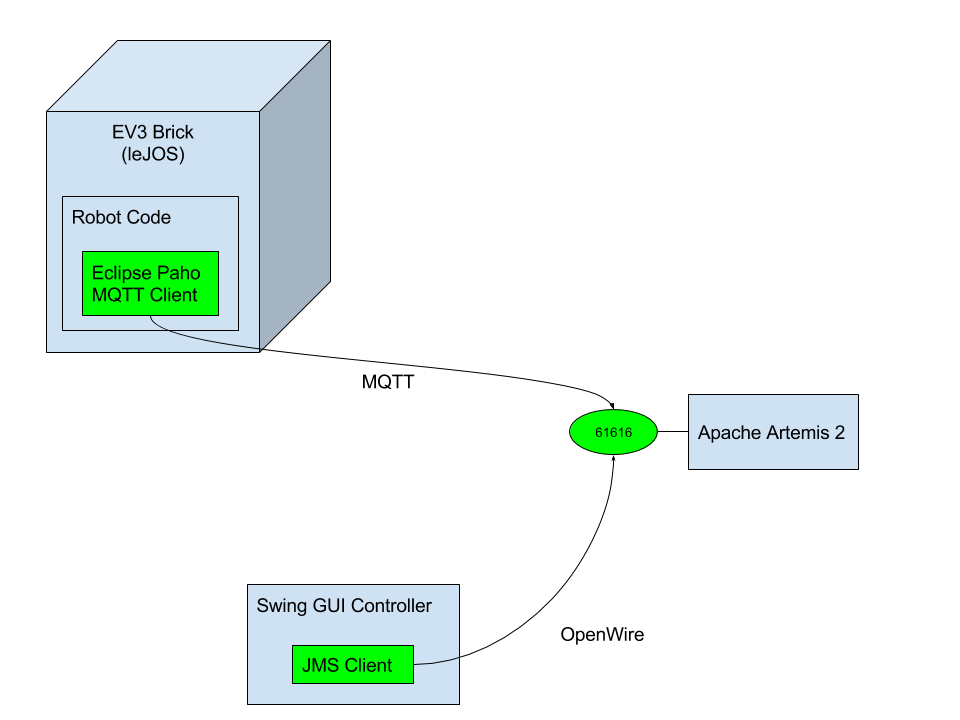
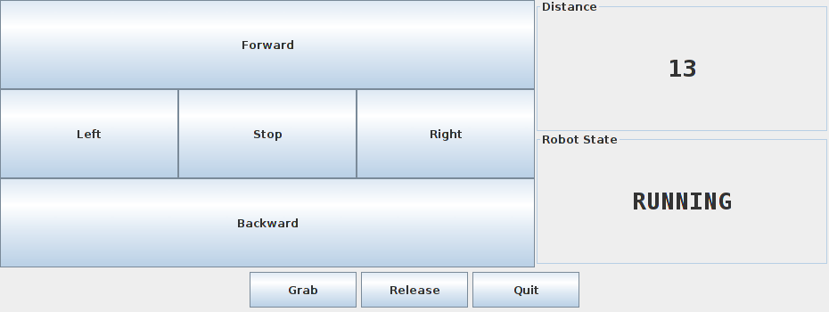

# Lego EV3 + Apache Artemis 2.0 Demo
## Introduction
This project is intended to demonstrate an integration between Lego EV3 robot with an MQTT-enabled server Apache Artemis 2.0.

The demo consists of two main components
 * a code propelling the rebot
 * a Swing GUI appliaction controlling the robot
 
 The demo deployment looks like the picture
 
 
## Hardware
The robot is built from [LEGO MINDSTORMS EV3 Home Edition](https://www.lego.com/en-us/mindstorms/). The robot itself is one of the stock robots [GRIPP3R](https://www.lego.com/en-us/mindstorms/build-a-robot/gripp3r).
The main features of the robot are
  * a track-based drive
  * a gripping hand
  * IR Sensor to detect distances
 
## Software
The robot software is written in [Java 8](http://www.oracle.com/technetwork/java/javase/overview/java8-2100321.html) - using [leJOS project](http://www.lejos.org/ev3.php).

[Eclipse Paho](http://www.eclipse.org/paho/) was chosen as an [MQTT](http://mqtt.org/) client because it runs well with [Java compact2 profile](http://www.oracle.com/technetwork/java/embedded/resources/tech/compact-profiles-overview-2157132.html).

The controller application is a plain Java SE application using [Java Message Service API](https://docs.oracle.com/javaee/7/tutorial/jms-concepts.htm) to communicate with a message broker. The application controls the robot's movement and displays information provided by the robot about is state and environment.


[Apache ActiveMQ Artemis](https://activemq.apache.org/artemis/) is used as a "glue" that enables bi-directional communication between the controller and the robot. Artemis is a multi-protocol message broker so any client (like AMQP-based client) can be used to communicate with the robot.

## Communication protocol
There are three topics in the broker used as communication channels between the robot and any controller
 * ev3.Commands - Clients send text message to control the robot's behaviour. The messagens known to robot are defined in the [Java enum](src/main/java/org/jboss/demo/artemis/ev3/Command.java).
 * ev3.Sensor.Distance - The robot sends a text message containing distance from a potential obstacle detected by the IR sensor measured in centimetres
 * ev3.State - the robot sends a text message informing the world about its state. The state is defined by the [Java enum](src/main/java/org/jboss/demo/artemis/ev3/RobotState.java).

## Installation
### leJOS
 * [Download](https://sourceforge.net/projects/ev3.lejos.p/files/0.9.1-beta/) leJOS 0.9.1 Beta
 * [Prepare](http://gjf2a.blogspot.cz/2015/05/setting-up-lejos-09-with-java-8.html) Java 8 Embedded JRE package and [install](https://sourceforge.net/p/lejos/wiki/Installing%20leJOS/) leJOS
 * Set EV3_HOME environment variable to point to the leJOS directory

### ActiveMQ Artemis
 * [Download](https://activemq.apache.org/artemis/download.html) ActiveMQ Artemis 2.0.0
 * Uncompress the package
 * [Create](https://activemq.apache.org/artemis/docs/2.0.0/using-server.html) a broker instance

## How to run
 * Connect the robot to a developer machine using Bluetooth, Wi-Fi or USB cable
 * Find an IP address (`BROKER_IP`) of the developer's machine network interface that communicates with the robot
 * [Start](https://activemq.apache.org/artemis/docs/2.0.0/using-server.html) the ActiveMQ Artemis broker instance
 * Deploy the robot code to the robot
```
mvn -Probot install
```
 * Connect to the robot via [ssh](https://sourceforge.net/p/lejos/wiki/Connecting%20to%20the%20EV3%20with%20ssh/) and start the robot code
```
jrun /home/lejos/programs/ev3-artemis.jar <BROKER_IP>
```
 * Start Controller GUI
```
mvn -Pcontroller exec:java
```
 * You can use Mosquitto CLI commands to monitor the messages and control the robot from CLI
```
mosquitto_pub -h localhost -p 61616 -t ev3.Commands -m FORWARD
mosquitto_sub -h localhost -p 61616 -t ev3.Commands
```
